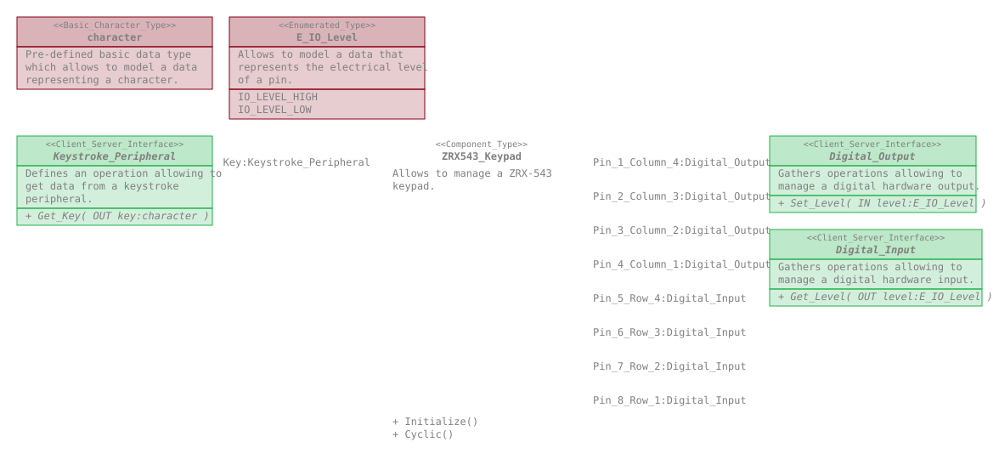
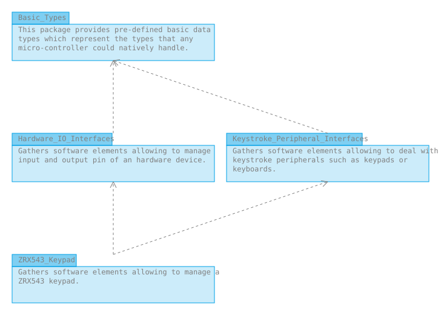

# ZRX543_Keypad

This repository defines a package gathering software elements allowing to manage
a ZRX-543 keypad.

## Content

The ZRX543_Keypad package gathers :
* Component_Types :
  * ZRX543_Keypad
  
## Overview

## Dependencies

* Hardware_IO_Interfaces : https://github.com/SanteyneEmbeddedSystems/Hardware_IO_Interfaces/releases/tag/v2.0.0
* Keystroke_Peripheral_Interfaces : https://github.com/SanteyneEmbeddedSystems/Keystroke_Peripheral_Interfaces/releases/tag/v1.0.0

## Use

### With the Arduino IDE

This repository shall be clone within the _libraries_ folder of the _Arduino
sketchbook folder_.